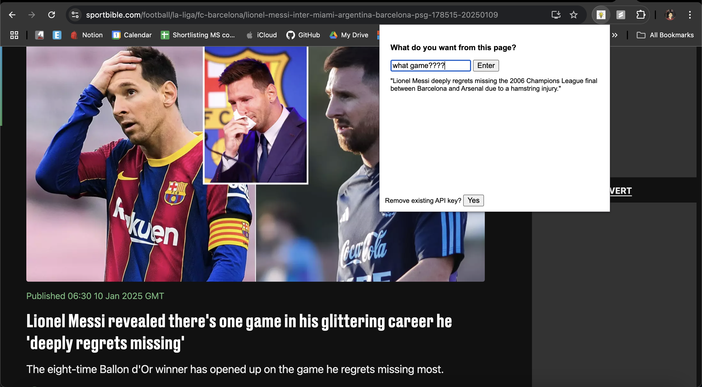
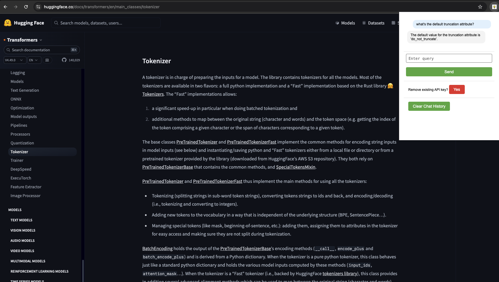

# What's this?

Jump [here](#setup) for setup instructions.

Being lazy doesn't mean you don't wanna learn or read. Maybe the content is too long, like this readme maybe.

Often when I'm browsing the web, I just want to skip to the point without needing to switch apps.

Weird news articles that has craploads of ads where you just wanna get to the point? Long docs from huggingface that you wanna skip?

🆕 UI is better now - looks like a chat app
🆕 Added previous context to the chat history

## Now what?

Here's a simple chrome extension to help you out.

Just ask it about the page you're on, and get to the point.

Yeah I hate when sportbible does this btw.

Easy to just find what you want really.

## Setup

1. Enable Developer Mode in Chrome

Open Chrome and go to the Extensions page:

- Navigate to chrome://extensions/ in the address bar.
- Alternatively, click the three-dot menu in the top-right corner > More tools > Extensions.

2. Enable Developer mode:

   - Toggle the Developer mode switch in the top-right corner of the Extensions page.

3. Load Your Extension
   1. Click the “Load unpacked” button.
   2. Browse and select the folder containing the extension files.
   3. Chrome will load your extension, and it should appear in the list of installed extensions.
