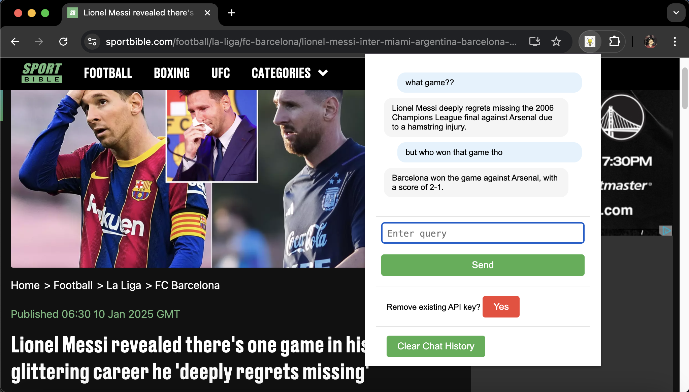

# What's this?

TL;DR - A chrome extension to ask the web page you're on to summarize itself/answer specific questions about it.

Being lazy doesn't mean you don't wanna learn or read. Maybe the content is too long, like this readme maybe.

Often when I'm browsing the web, I just want to skip to the point without needing to switch apps.

Weird news articles that has craploads of ads where you just wanna get to the point? Long docs from huggingface that you wanna skip?

Jump [here](#setup) for setup instructions.

🚨🆕 UI is better now - looks like a chat app

🚨🆕 Added previous context to the chat history

## Now what?

Here's a simple chrome extension to help you out.

Just ask it about the page you're on, and get to the point.

For example, the very annoying sportbible that has craploads of ads with only the single line somewhere in the middle of the page that you want to read to get the actual news out of it ⬇️

or maybe you're reading a long doc from huggingface and you just want to skip to the part that answers your question⬇️

Easy to just find what you want really.

## Setup

1. Enable Developer Mode in Chrome

Open Chrome and go to the Extensions page:

- Navigate to chrome://extensions/ in the address bar.
- Alternatively, click the three-dot menu in the top-right corner > More tools > Extensions.

2. Enable Developer mode:

   - Toggle the Developer mode switch in the top-right corner of the Extensions page.

3. Load Your Extension
   1. Click the “Load unpacked” button.
   2. Browse and select the folder containing the extension files.
   3. Chrome will load your extension, and it should appear in the list of installed extensions.
